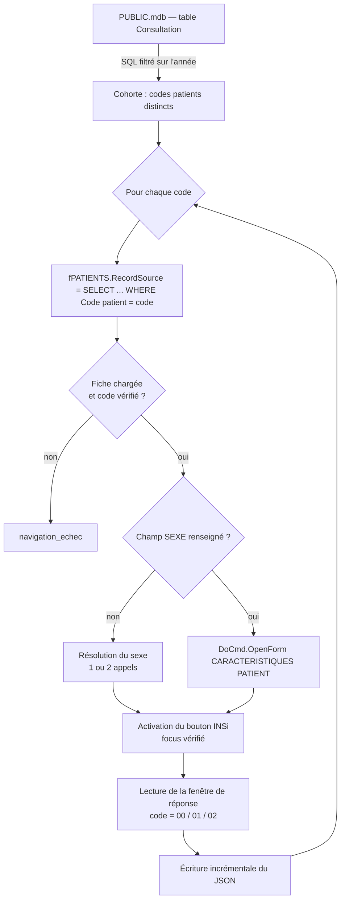

# Étude INSi — StudioVision

Outil d'audit qui mesure, sur une cohorte de patients, la capacité du téléservice **INSi** à
retrouver chaque patient à partir de ses traits d'identité tels qu'ils sont enregistrés dans
**StudioVision**, et qui corrige automatiquement les fiches dont le champ *sexe* est vide.

L'outil pilote StudioVision par **automatisation COM** (Microsoft Access), déclenche l'appel
INSi, lit la fenêtre de réponse, classe le résultat, puis produit des **statistiques** et la
**liste nominative des patients dont les traits d'identité divergent** du référentiel national.

---

## Table des matières

- [Contexte](#contexte)
- [Avertissements](#avertissements)
- [Prérequis](#prérequis)
- [Installation](#installation)
- [Utilisation](#utilisation)
- [Fonctionnement](#fonctionnement)
  - [Connexion à StudioVision](#connexion-à-studiovision)
  - [Sélection de la cohorte](#sélection-de-la-cohorte)
  - [Ouverture d'une fiche patient](#ouverture-dune-fiche-patient)
  - [Séquence d'appel INSi](#séquence-dappel-insi)
  - [Classification des réponses](#classification-des-réponses)
  - [Résolution du sexe manquant](#résolution-du-sexe-manquant)
  - [Reprise après interruption](#reprise-après-interruption)
- [Fichiers produits](#fichiers-produits)
- [Configuration](#configuration)
- [Limites connues](#limites-connues)
- [Dépannage](#dépannage)
- [Confidentialité et conformité](#confidentialité-et-conformité)
- [Annexe — cartographie de StudioVision](#annexe--cartographie-de-studiovision)
- [Licence](#licence)

---

## Contexte

L'**Identifiant National de Santé** (INS) est le préalable à toute interopérabilité en santé :
sans INS validé, aucun document ne peut être déposé au Dossier Médical Partagé. L'INS s'obtient
via le téléservice **INSi** (opérateur : GIE SESAM-Vitale), soit par lecture de la carte Vitale,
soit par **appel sur traits d'identité** (nom de naissance, prénoms, date de naissance, sexe,
lieu de naissance).

Un appel sur traits ne réussit que si les traits enregistrés dans le logiciel métier
correspondent **exactement** à ceux du référentiel d'identités. En pratique, une base
constituée sur plusieurs décennies contient des noms d'usage saisis à la place des noms de
naissance, des prénoms composés tronqués, des dates approximatives, des champs vides.

Cet outil quantifie ce décalage : il exécute l'appel INSi pour chaque patient d'une cohorte et
enregistre le code de retour, sans jamais dépendre d'une saisie manuelle. Il produit ainsi une
mesure objective de la **qualité du référentiel d'identités local**, préalable chiffré à tout
projet d'intégration Ségur.

StudioVision (RealVision) est un logiciel d'ophtalmologie bâti sur Microsoft Access : une
application front-end compilée (`Ophprog.mde`) reliée à une base de données Jet (`PUBLIC.mdb`).
Il expose une carte INSi et un bouton d'appel, mais aucune API. L'outil s'appuie donc sur
l'automatisation OLE d'Access, complétée par l'API Windows pour les boîtes de dialogue natives.

---

## Avertissements

> [!WARNING]
> **Cet outil écrit dans la base de données de production.** La résolution du sexe manquant
> modifie le champ `SEXE` de la table `patients`. Sauvegardez `PUBLIC.mdb` avant toute
> exécution, et validez le comportement sur un petit lot (voir [Utilisation](#utilisation)).

> [!IMPORTANT]
> **Appels INSi en masse.** Le référentiel INS prévoit que l'opération de *récupération* du
> téléservice INSi soit appelée au fil des venues des patients, et non en lot sur l'ensemble
> d'une base d'identités ; les appels sont tracés côté téléservice. Consultez le
> [guide d'implémentation de l'INS](https://esante.gouv.fr/sites/default/files/media_entity/documents/ins-guide-implementation.pdf)
> et, le cas échéant, votre délégué à la protection des données avant d'exécuter une campagne
> complète. Pour la seule correction du champ *sexe*, la déduction depuis le NIR **sans appel
> INSi** est une alternative sans incidence réglementaire.

> [!NOTE]
> Pendant l'exécution, **n'utilisez ni le clavier ni la souris** sur le poste : l'activation du
> bouton INSi repose sur le focus du contrôle Access. L'outil vérifie le focus avant chaque
> frappe et s'interrompt plutôt que d'envoyer une touche à l'aveugle, mais une interaction
> concurrente fera échouer les appels.

---

## Prérequis

| Élément | Version / détail |
|---|---|
| Système | Windows 7 SP1 ou ultérieur (testé sur Windows 10 et 11) |
| Python | 3.8 ou ultérieur, 64 bits de préférence |
| Dépendance | [`pywin32`](https://pypi.org/project/pywin32/) (COM). `analyse_statistique.py` n'en a aucune. |
| Logiciel métier | StudioVision **ouvert**, avec **une fiche patient affichée** |
| Carte | CPS insérée et code porteur saisi au moins une fois avant le lancement |
| Accès | Lecture de `PUBLIC.mdb` ; écriture sur `patients.SEXE` si la résolution du sexe est utilisée |

L'outil se connecte à l'instance Access **déjà lancée** ; il n'ouvre ni ne ferme StudioVision.

---

## Installation

```bash
git clone https://github.com/Ophtao-Program/Etude-appel-INSi-StudioVision
cd Etude-INSi-StudioVision
pip install pywin32
```

Aucune compilation, aucun service, aucune modification de StudioVision. L'outil peut être
copié tel quel sur le poste et exécuté depuis n'importe quel répertoire accessible en écriture
(les fichiers de résultats sont créés à côté des scripts).

---

## Utilisation

Deux entrées équivalentes : les lanceurs `.bat` (double-clic) ou la ligne de commande.

### Déroulé recommandé

| Étape | Lanceur | Ce qu'il fait | Appelle INSi ? |
|---|---|---|---|
| 0 | `0 - Inspecter les formulaires` | Énumère les formulaires ouverts et leurs contrôles. Diagnostic. | Non |
| 1 | `1 - Lister patients 2026` | Valide la lecture de `PUBLIC.mdb` et affiche la cohorte. | Non |
| 2 | `2 - Tester ouverture de N fiches` | Charge N fiches par réécriture du `RecordSource`. Détecte les codes patients atypiques. | Non |
| 3 | `3 - Tester UN patient` | Chaîne complète sur un code, avec trace détaillée de chaque étape. | Oui (1) |
| 4 | `4 - Etude INSi (test 10 patients)` | Étude limitée à 10 patients. | Oui |
| 5 | `5 - Etude INSi (complete)` | Étude sur toute la cohorte. Reprend là où elle s'était arrêtée. | Oui |
| 6 | `6 - Corriger le sexe` | Rejoue la résolution du sexe sur les patients laissés sans réponse dans un résultat existant. | Oui |
| 7 | `7 - Analyse statistique` | Produit le rapport et les exports. Lecture de fichier uniquement. | Non |

Les étapes 1 à 3 sont des validations : elles ne consomment aucun appel inutile et permettent de
confirmer la cartographie des contrôles sur une installation donnée.

### Ligne de commande

```bash
# Diagnostic
python -u etude_insi.py --inspecter
python -u etude_insi.py --lister
python -u etude_insi.py --test-ouverture 50     # sans argument : toute la cohorte

# Étude
python -u etude_insi.py --patient 5182          # un patient, verbeux
python -u etude_insi.py --test                  # 10 patients
python -u etude_insi.py --annee 2025 --limit 200
python -u etude_insi.py                         # cohorte complète

# Correction du sexe sur un résultat existant
python -u test_resolution_sexe.py --limit 20

# Statistiques (hors ligne, sans StudioVision)
python -u analyse_statistique.py --total 3500
```

Une interruption par `Ctrl+C` est sûre : l'avancement est déjà écrit sur disque.

---

## Fonctionnement



### Connexion à StudioVision

L'instance Access est retrouvée par énumération de la **Running Object Table** (ROT) plutôt que
par `GetActiveObject`, afin de gérer la présence simultanée de plusieurs instances Access sur le
poste. Le candidat retenu est celui qui expose un projet courant et le plus grand nombre de
formulaires ouverts.

Cette méthode échoue si l'outil et StudioVision ne s'exécutent pas dans le même contexte de
sécurité : lancer l'un des deux en tant qu'administrateur les isole l'un de l'autre.

### Sélection de la cohorte

La table `Consultation` de `PUBLIC.mdb` est interrogée via `CurrentDb()` — la table y est déjà
liée, ce qui évite d'ouvrir une seconde connexion et tout problème de pilote ODBC. Le filtrage
sur l'année et le regroupement par patient sont délégués au moteur :

```sql
SELECT [Code patient], MAX([Date])
FROM [Consultation]
WHERE [Date] >= #01/01/2026# AND [Date] < #01/01/2027#
GROUP BY [Code patient]
```

Les littéraux de date Access sont au format `#MM/DD/YYYY#`. Un repli par lecture en blocs
(`GetRows`) est prévu si la requête groupée est refusée.

### Ouverture d'une fiche patient

Le formulaire `fPATIENTS` n'est **pas** lié à la table `patients` entière : sa source est une
requête filtrée sur un seul patient, reconstruite par StudioVision à chaque changement de fiche.
Un `RecordsetClone` ne contient donc qu'un enregistrement, et la navigation par `FindFirst` /
`Bookmark` est inopérante.

L'outil reproduit le mécanisme interne : il réécrit la source du formulaire, puis vérifie que le
contrôle `Code patient` affiche bien le code demandé.

```python
f = acc.Forms("fPATIENTS")
f.RecordSource = "select * from patients where [Code patient] = 5182"
f.Requery()
assert f.Controls("Code patient").Value == 5182   # vérification obligatoire
```

Aucune frappe clavier, aucune fenêtre de recherche, aucun passage par le menu général. Un appel
INSi n'est jamais émis tant que le code affiché ne correspond pas au code attendu, ce qui exclut
d'interroger le téléservice sur un mauvais patient. La source initiale du formulaire est
restaurée en fin d'exécution.

### Séquence d'appel INSi

Le bouton INSi vit dans un sous-formulaire (`CARACTERISTIQUES PATIENT`, classe fenêtre
`OFormPopup`), ouvert par `DoCmd.OpenForm`. `InvokePattern.Invoke()` d'UI Automation est
sans effet sur ce type de bouton Access : l'activation passe donc par un `SetFocus` COM,
**vérifié par `Screen.ActiveControl`**, suivi d'un `VK_SPACE` envoyé par `keybd_event`. Si le
focus n'est pas confirmé, aucune touche n'est émise et le patient est classé en erreur.

StudioVision présente ensuite l'un de **deux enchaînements**, tous deux gérés :

1. une boîte de validation des traits (`#32770`, titre « Identifiant National de Santé — traits
   d'identité »), dont les champs sont lus par identifiant de contrôle, puis validée (`OK`,
   id `1`) ; la fenêtre de réponse suit ;
2. la fenêtre de réponse directement.

La réponse est un contrôle statique (id `65535`) contenant un bloc `clé=valeur` :

```
Reponse=
code=01
INS=
OID=
Nom=
Prenom=
Prenoms=
Sexe=
Date_naissance=
Lieu_naissance=
```

Un contrôle de cohérence compare le nom retourné au nom de la fiche chargée ; toute divergence
est signalée dans le champ `detail`.

### Classification des réponses

| Classification | Signification | Définitive |
|---|---|---|
| `00_trouve` | Patient trouvé, INS obtenu | ✅ |
| `01_non_trouve` | Aucune identité correspondante : **les traits divergent du référentiel** | ✅ |
| `02_plusieurs` | Plusieurs identités correspondent (traits insuffisamment discriminants) | ✅ |
| `pas_sexe_pas_numSS` | Sexe vide, aucun NIR, aucun sexe essayé n'aboutit | ✅ |
| `pas_sexe_enfant` | Sexe vide, fiche « Enfant », aucun sexe essayé n'aboutit | ✅ |
| `sexe_non_resolu` | Sexe vide, NIR présent, aucun sexe essayé n'aboutit | ✅ |
| `navigation_echec` | Fiche non chargée (code absent, source refusée) | ❌ |
| `sous_formulaire_absent` | Échec d'ouverture du sous-formulaire (incident Access) | ❌ |
| `erreur_appel` | Bouton INSi non activable, aucun dialogue | ❌ |
| `sans_reponse` | Aucune fenêtre de réponse (téléservice muet, erreur technique) | ❌ |
| `reponse_illisible` | Fenêtre de réponse vide ou illisible | ❌ |
| `exception` | Exception Python non prévue | ❌ |

Seules les classifications **définitives** sont conservées lors d'une reprise ; les autres sont
rejouées automatiquement.

`01_non_trouve` est la mesure centrale de l'étude : elle traduit une incohérence entre le
référentiel local et le référentiel national, non un dysfonctionnement.

### Résolution du sexe manquant

Un champ `SEXE` vide provoque l'erreur téléservice `insi_24` (*le format du champ sexe est
incorrect*) : l'appel échoue sans jamais interroger le référentiel. L'outil ne soumet donc
**jamais** un appel avec un sexe vide ; il renseigne d'abord le champ.

Le premier caractère du NIR code le sexe (`1` = masculin, `2` = féminin). Cette déduction est
invalide pour un enfant, dont la fiche porte le NIR d'un parent : ce cas est écarté par le champ
`Titre`.

```
si NIR présent et Titre ≠ « Enfant » :
    ordre d'essai = [sexe déduit du NIR, sexe opposé]
sinon :                                   # enfant, NIR absent, ou NIR non exploitable
    ordre d'essai = [F, M]

pour chaque sexe de l'ordre d'essai :     # 2 appels INSi au maximum
    écrire patients.SEXE
    recharger la fiche
    appeler INSi
    si code ∈ {00, 02} :
        conserver le sexe   →  la fiche est corrigée durablement
        arrêter

aucun essai concluant :
    remettre patients.SEXE à vide         →  aucune donnée inventée n'est laissée en base
```

Un code `01` sur les deux essais n'est pas concluant : le patient reste introuvable quel que
soit le sexe, le champ est donc restauré à vide. Chaque enregistrement conserve la méthode
employée (`sexe_source`), le sexe retenu (`sexe_corrige`) et le nombre d'appels (`nb_appels_insi`).

### Reprise après interruption

`etude_insi_resultats.json` est réécrit **après chaque patient** (écriture atomique via fichier
temporaire puis `os.replace`). Au lancement, les enregistrements existants sont indexés par code
patient :

- classification **définitive** → le patient est ignoré ;
- classification **non définitive** → le patient est rejoué et son enregistrement remplacé ;
- code absent du fichier → le patient est traité.

Aucune édition manuelle du fichier n'est nécessaire après un incident : relancer suffit. En cas
d'échec transitoire, un patient est réessayé une fois après une pause. Si StudioVision cesse de
répondre, l'étude s'arrête proprement au lieu d'accumuler des erreurs en cascade.

---

## Fichiers produits

| Fichier | Contenu |
|---|---|
| `etude_insi_resultats.json` | Un enregistrement par patient. Source de vérité, support de la reprise. |
| `etude_insi_statistiques.json` | Mesures agrégées, exploitables par un autre programme. |
| `etude_insi_rapport.md` | Rapport lisible, partageable en l'état. |
| `etude_insi_01_non_trouve.csv` | **Patients dont les traits divergent du référentiel** — livrable actionnable. |
| `etude_insi_a_reprendre.csv` | Incidents techniques restants. |
| `etude_insi_sexe_corrige.csv` | Fiches dont le champ sexe a été corrigé. |
| `etude_ouverture_resultats.json` | Résultats du test d'ouverture des fiches. |

Les CSV sont encodés en UTF-8 avec BOM et séparés par `;` : ils s'ouvrent directement dans une
installation francophone d'Excel.

### Schéma d'un enregistrement

```jsonc
{
  "index": 412,
  "code_patient": "5182",
  "date_consultation": "2026-06-08",
  "classification": "01_non_trouve",
  "reponse": "",                      // libellé renvoyé par le téléservice
  "code": "01",                       // 00 | 01 | 02
  "nom": "", "prenoms": "",           // traits renvoyés par INSi (si trouvé)
  "sexe": "", "date_naissance": "", "lieu_naissance": "",
  "nom_fiche": "MEGRET",              // traits lus dans StudioVision
  "prenom_fiche": "Leo",
  "sexe_fiche": "1",                  // 1 = M, 2 = F
  "date_naissance_fiche": "1999-11-23",
  "num_ss_present": true,             // booléen — le NIR lui-même n'est pas stocké
  "titre": "",
  "sexe_source": "present",           // present | numSS | enfant | sans_numSS | numSS_invalide
  "sexe_corrige": "",                 // M | F si le champ a été corrigé
  "nb_appels_insi": 1,
  "sexe_manquant": false,
  "ins_present": false,
  "ins_masque": "",                   // ex. "1XXXXXXXXXXX870" — jamais l'INS complet
  "detail": "",
  "horodatage": "2026-07-07 14:25:55"
}
```

---

## Configuration

Toutes les constantes sont en tête de `etude_insi.py`.

| Constante | Défaut | Rôle |
|---|---|---|
| `PUBLIC_MDB` | `M:\fichier\PUBLIC.mdb` | Base de données (repli si `CurrentDb()` échoue) |
| `TABLE_CONSULT` / `CHAMP_DATE` | `Consultation` / `Date` | Source de la cohorte |
| `ANNEE_DEFAUT` | `2026` | Année étudiée |
| `FORM_PATIENT` | `fPATIENTS` | Formulaire de la fiche patient |
| `RS_GABARIT` | `select * from patients where [Code patient] = %s` | Gabarit de la source du formulaire |
| `CTRL_CODE` / `CTRL_NOM` / `CTRL_PRENOM` | `Code patient` / `NOM` / `Prénom` | Contrôles lus sur la fiche |
| `TABLE_PATIENTS` | `patients` | Table cible de l'écriture du sexe |
| `CHAMP_SEXE_TABLE` | `SEXE` | Champ sexe |
| `SEXE_M` / `SEXE_F` | `1` / `2` | Valeurs écrites — **à vérifier sur votre base** |
| `CHAMP_NUMSS` / `CHAMP_TITRE` | `SS` / `Titre` | NIR et statut |
| `VAL_TITRE_ENFANT` | `Enfant` | Valeur du champ `Titre` désignant un enfant |
| `SUBFORM_FORM_NAME` | `CARACTERISTIQUES PATIENT` | Sous-formulaire portant le bouton INSi |
| `INSI_BTN_NAME` | `Commande136` | Bouton INSi (repli par `Caption`) |
| `NAV_ATTENTE` | `4` s | Délai maximal de chargement d'une fiche |
| `CLICK_CONFIRM` | `10` s | Délai d'apparition d'un dialogue après activation |
| `WAIT_REPONSE` | `60` s | Délai d'attente de la réponse du téléservice |
| `INTER_APPEL` | `0,15` s | Pause entre deux patients |

Les noms de contrôles peuvent varier d'une version de StudioVision à l'autre : `--inspecter` les
énumère sur l'installation cible.

---

## Limites connues

**Saturation mémoire d'Access.** Réécrire la source du formulaire avec une requête SQL distincte
à chaque patient alimente le cache de requêtes du moteur Jet, qui n'est pas libéré. Après
plusieurs milliers d'itérations, Access affiche « Mémoire insuffisante pour exécuter cette
opération » ; cette boîte modale bloque l'appel COM en cours, et StudioVision refuse alors de se
fermer (« Impossible de quitter StudioVision pour l'instant… un module Visual Basic qui utilise
OLE ou DDE »). L'outil libère ses propres références et marque une pause périodique, mais ne peut
pas vider un cache interne au moteur.

*Contournement* : traiter la cohorte en plusieurs sessions, en redémarrant StudioVision entre
chaque. La reprise étant automatique, aucun travail n'est perdu.

**Durée.** Le temps total est dominé par la latence réseau du téléservice, incompressible. Une
cohorte de quelques milliers de patients s'étale sur plusieurs heures.

**Poste dédié.** L'activation du bouton INSi repose sur le focus : le poste ne peut pas être
utilisé pendant l'exécution.

**Sessions concurrentes.** Une seule instance de l'outil à la fois, et StudioVision ne doit pas
être piloté simultanément par un autre automate.

---

## Dépannage

| Symptôme | Cause | Action |
|---|---|---|
| `StudioVision (Access) introuvable` | ROT inaccessible, ou contextes de sécurité distincts | Lancer l'outil et StudioVision avec le même compte, sans élévation |
| `fiche fPATIENTS non ouverte` | Aucune fiche patient affichée | Ouvrir une fiche quelconque, puis relancer |
| `focus non obtenu … aucune touche envoyée` | Le poste est utilisé pendant l'exécution | Ne pas toucher clavier ni souris |
| `Mémoire insuffisante` (boîte Access) | Saturation du cache Jet | Terminer `python.exe`, fermer la boîte, redémarrer StudioVision, relancer l'étude |
| `Impossible de quitter StudioVision` | Un appel COM est bloqué par une boîte modale | Terminer `python.exe` d'abord, la boîte se ferme ensuite |
| `sous_formulaire_absent` récurrent | Saturation d'Access | Redémarrer StudioVision ; les cas seront rejoués à la reprise |
| Le code porteur est demandé | Session carte CPS expirée | Le saisir : l'outil attend jusqu'à `WAIT_REPONSE` secondes |
| `01_non_trouve` massif | Traits d'identité divergents | Résultat attendu de l'étude — voir `etude_insi_01_non_trouve.csv` |

---

## Confidentialité et conformité

- **L'INS complet n'est jamais écrit** : seuls un booléen de présence et une forme masquée
  (`1XXXXXXXXXXX870`) sont conservés.
- **Le NIR n'est jamais écrit** : seul le booléen `num_ss_present` est conservé. Le premier
  caractère est lu en mémoire pour déduire le sexe, puis abandonné.
- Les traits d'identité (nom, prénom, date de naissance, sexe) sont conservés car ils
  constituent l'objet même de l'analyse.
- Les fichiers produits contiennent des **données de santé à caractère personnel** : ils doivent
  rester sur un poste du cabinet, dans le périmètre du traitement déclaré.
- L'écriture du champ `SEXE` modifie le dossier patient. Elle n'est effectuée que lorsque le
  téléservice confirme l'identité (`00` ou `02`) ; dans le cas contraire le champ est restauré à
  vide, afin de ne jamais laisser en base une donnée d'état civil devinée.
- Voir également l'avertissement sur les [appels en masse](#avertissements).

---

## Annexe — cartographie de StudioVision

Relevée par `--inspecter` sur StudioVision 6.68. Elle peut différer selon les versions.

### Formulaires

| Formulaire | Rôle | Éléments notables |
|---|---|---|
| `MENU GENERAL` | Menu principal | `RecordSource = version` ; les « boutons » sont des `Label` |
| `fPATIENTS` | Fiche patient | `RecordSource` = requête filtrée sur un patient |
| `LISTE des PATIENTS` | Recherche (non utilisée) | `DebutDuNom`, `TxPrénom`, liste `Choix` |
| `CARACTERISTIQUES PATIENT` | Sous-formulaire, classe `OFormPopup` | Porte le bouton INSi |

### Contrôles utilisés

| Formulaire | Contrôle | Type | Usage |
|---|---|---|---|
| `fPATIENTS` | `Code patient` | TextBox | Vérification du patient chargé |
| `fPATIENTS` | `NOM`, `Prénom` | TextBox | Traits affichés |
| `fPATIENTS` | `BtnOuvrirFiche` | CommandButton | Ouvre `LISTE des PATIENTS` (non utilisé) |
| `CARACTERISTIQUES PATIENT` | `Commande136` | CommandButton | Bouton `INSi` |

### Champs de la table `patients`

40 champs, dont : `Code patient`, `Titre`, `NOM`, `Prénom`, `Date de Naissance`, `SS` (NIR),
`SEXE` (`1` = M, `2` = F), `Adresse`, `Code Postal + Ville`, `CodeExterneAP`.

### Fenêtres natives (Win32)

| Fenêtre | Classe | Contrôles |
|---|---|---|
| Validation des traits | `#32770` | Nom `500`, Prénom `501`, Lieu `502`, Sexe `503`, date `900`/`901`/`902`, OK `1` |
| Réponse INSi | `#32770` | Statique `65535` (bloc `clé=valeur`), OK `2` |

---

## Licence

Ce dépôt est publié sous licence MIT. Il est fourni sans garantie : il pilote un logiciel métier
et écrit dans une base de données de production. L'exploitation d'un téléservice de l'Assurance
Maladie relève de la responsabilité de la structure de soins.

StudioVision est une marque de RealVision. Ce projet n'est ni développé ni approuvé par
RealVision, ni par le GIE SESAM-Vitale, ni par l'Agence du Numérique en Santé.
